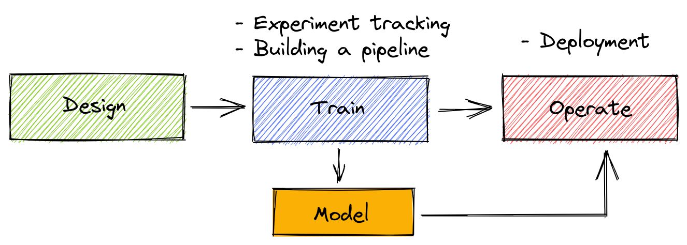
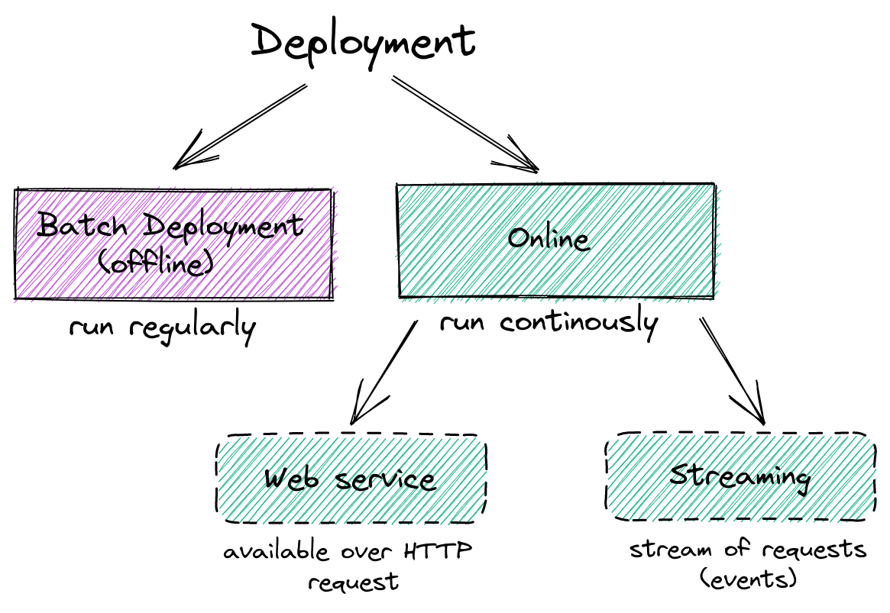
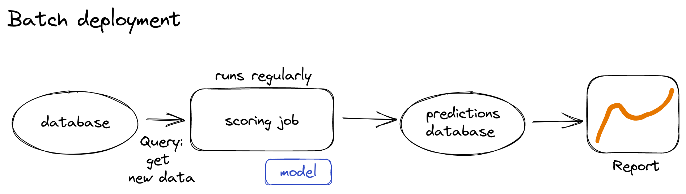
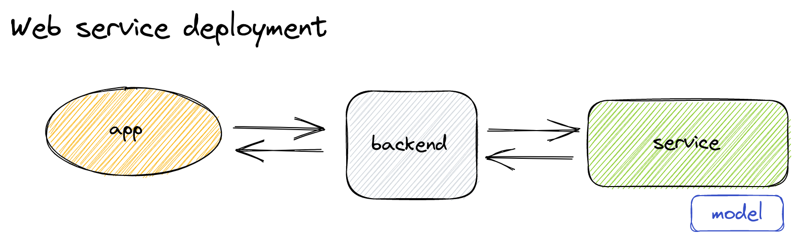
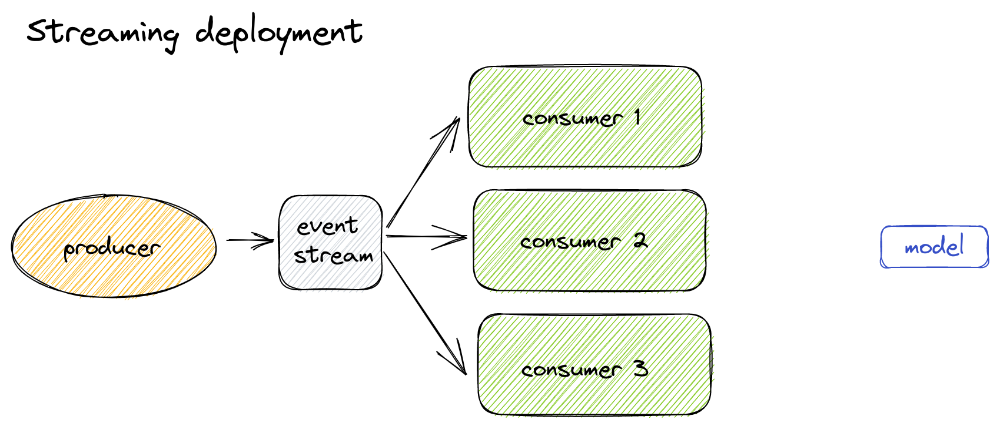

# Module 4: Model Deployment

## 4.1 Three ways of deploying a model

The operational phase follows the design and training phases of the machine learning pipeline. It consists of deploying your model to production.

Deploying the model has several options depending on when we want to get predictions, immediately or not.

- Batch (offline) deployment (models runs by request)
- Web service deployment (model is always running)
- Streaming deployment (model is always running)

### Batch deployment.

The model doesn't run all the time, but we regularly apply it to new data. The regularity could be hours, days, week *etc*.
A typical batch deployment pipeline is sketched below. Let's say we have a database with all the data.
The scoring job fetches some data from the database and applies the model to that data. The predictions are then written to another
database. Another software can read predictions and react to them, for example, by preparing a report or raising an alarm.

Batch deployment often used for marketing tasks. One example is churn identification, i.e. the identification of a user who is about to move to competitors.

### Web service deployment.

Users use an app that communicates with the backend, which in turn communicates with a service that runs the model.
The model needs to be always running. We have one-to-one client-server relationship. When the client sends a request,
it initiates the connection to the backend service which remains open during the processing operation.

For example, a client wants to know the duration of an upcoming taxi ride. The mobile app sends a request to the backend, which performs calculations using
the model in the service and returns the result back to the app.

### Streaming deployment
In the streaming settings, we have producers (they produce events) and consumers (they consume events). Producers pass some events to the event stream. 
Consumers read it and respond to events. Here we have one-to-many (single producer) or many-to-many (multiple producers) client-server relationship.

Producer send an event but does not really care what happens with it since there is not explicit connection between producers and consumers.

Let's have a look at the iweb service example. Now the backend becomes a producer. It generates the event "Ride started" containing all information about
the ride. Then multiple services consume this stream and run something for it:  

- consumer 1: tip prediction
- consumer 2: duration prediction consumer
- consumer 3: ...

## 4.2 Web-services: Deploying models with Flask and Docker
